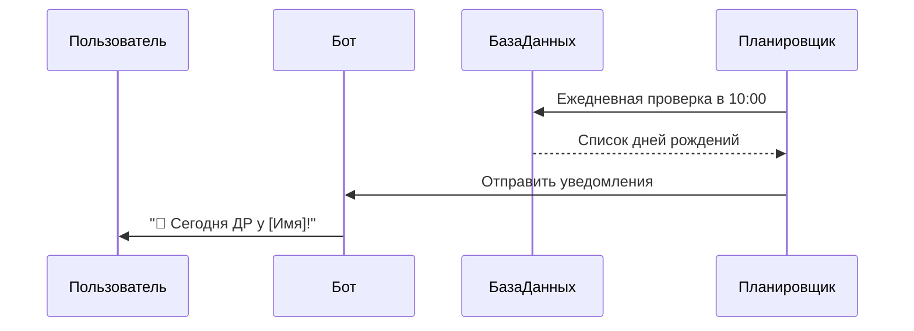
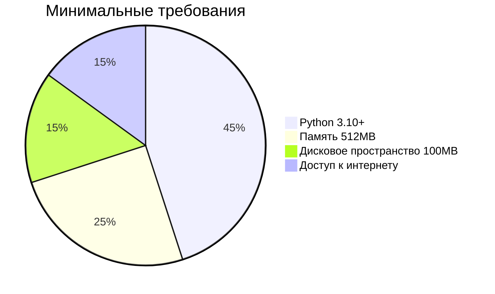
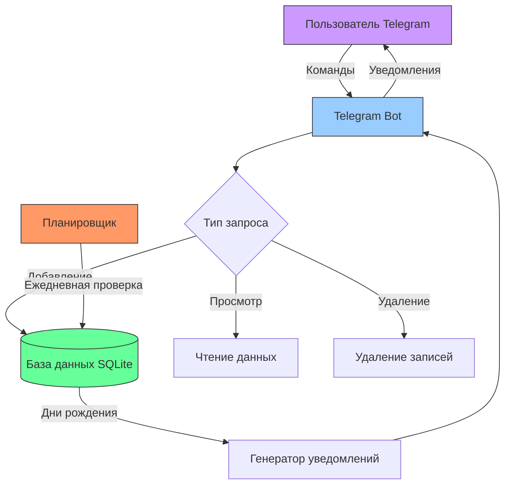
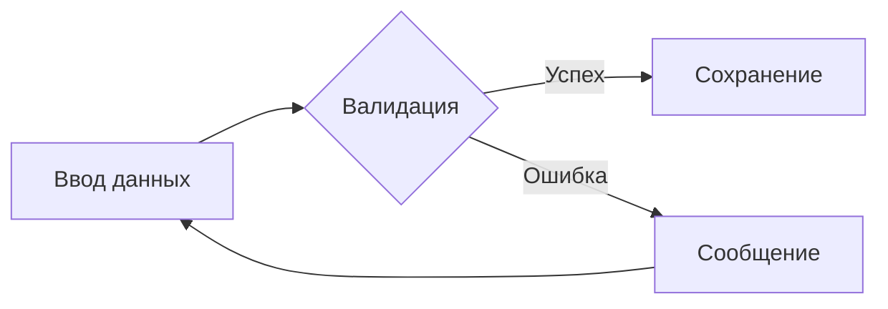
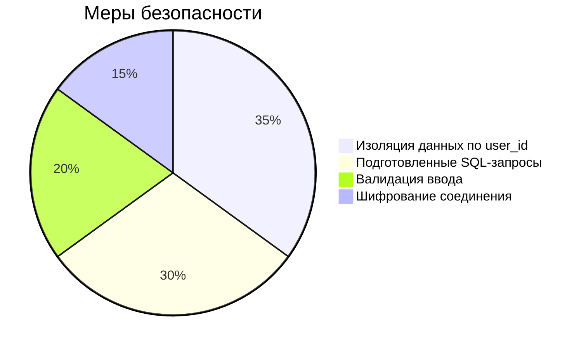
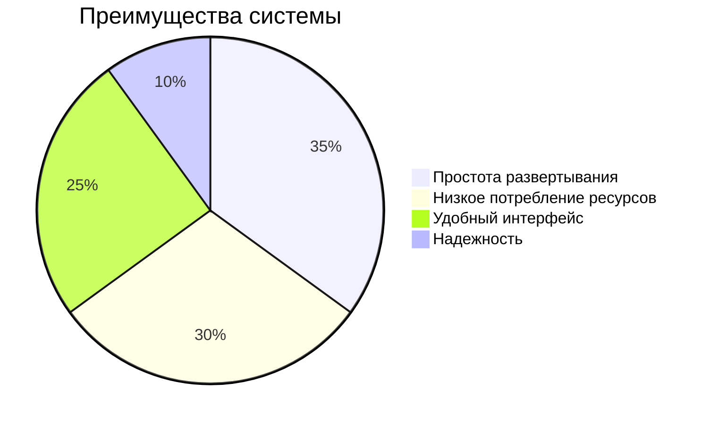

# Отчет по разработке Telegram-бота для напоминаний о днях рождения  (ТГ бот)[https://web.telegram.org/k/#@dr_happy_reminder_bot]
# Содержание

1. [Общая информация](#1-общая-информация)
   - 1.1 [Назначение проекта](#11-назначение-проекта)
   - 1.2 [Основные характеристики](#12-основные-характеристики)

2. [Технологический стек](#2-технологический-стек)
   - 2.1 [Используемые библиотеки](#21-используемые-библиотеки)
   - 2.2 [Структура БД](#22-структура-бд)

3. [Функциональные возможности](#3-функциональные-возможности)
   - 3.1 [Команды бота](#31-команды-бота)
   - 3.2 [Логика напоминаний](#32-логика-напоминаний)

4. [Установка и запуск](#4-установка-и-запуск)
   - 4.1 [Требования к системе](#41-требования-к-системе)
   - 4.2 [Пошаговая инструкция](#42-пошаговая-инструкция)

5. [Архитектура системы](#5-архитектура-системы)
   - 5.1 [Архитектурная схема системы](#51-архитектурная-схема-системы)
   - 5.2 [Файловая структура](#52-файловая-структура)

6. [Особенности реализации](#6-особенности-реализации)
   - 6.1 [Обработка ошибок](#61-обработка-ошибок)
   - 6.2 [Безопасность](#62-безопасность)

7. [Заключение](#7-заключение)

## 1. Общая информация

### 1.1 Назначение проекта
## Описание проекта

**Birthday Reminder Bot** - это Telegram-бот для автоматического учета дней рождения и отправки напоминаний. Основные функции:

- 📅 **Хранение дней рождения** в структурированной базе данных
- 🔔 **Автоматические уведомления** в 9:00 по московскому времени (UTC+3)
- 👤 **Персональная база** для каждого пользователя
- 📱 **Удобный интерфейс** через Telegram

**Как это работает:**
1. Пользователь добавляет дни рождения через команду `/add`
2. Бот сохраняет данные в SQLite-базе
3. Ежедневно в 9:00 система проверяет совпадения дат
4. При обнаружении дня рождения отправляется уведомление с:
   - Именем именинника
   - Возрастом (автоматический расчет)
   - Поздравительным сообщением

**Технические особенности:**
- Написано на Python 3.10+
- Использует библиотеку python-telegram-bot
- Хранение данных в SQLite с изоляцией по user_id
- Поддержка формата дат ДД.ММ.ГГГГ
- Защита от SQL-инъекций

Бот идеально подходит для:
- Личного использования (чтобы не забывать о днях рождения друзей)
- Корпоративного применения (учет дней рождения сотрудников)
- Общественных организаций (отслеживание важных дат)

### 1.2 Основные характеристики
| Параметр       | Значение                     |
|----------------|-----------------------------|
| Язык           | Python 3.10+                |
| База данных    | SQLite                      |
| Пользователи   | Мультипользовательский режим|
| Точность       | Учет времени UTC+3          |

## 2. Технологический стек

### 2.1 Используемые библиотеки
```python  
requirements.txt:
python-telegram-bot==20.7
python-dotenv==1.0.0
sqlite3==3.35+  # Встроенная в Python
```
### 2.2 Структура БД

```
CREATE TABLE IF NOT EXISTS birthdays (
    id INTEGER PRIMARY KEY AUTOINCREMENT,
    name TEXT NOT NULL,
    date DATE NOT NULL,
    user_id INTEGER NOT NULL,
    chat_id INTEGER NOT NULL
);
```
## 3. Функциональные возможности
### 3.1 Команды бота
```

- `/start` - Начало работы
- `/add` - Добавить запись:
  1. Ввод имени
  2. Ввод даты (формат: ДД.ММ.ГГГГ)
- `/list` - Показать все записи
- `/delete` - Удалить запись по имени
```
### 3.2 Логика напоминаний

## 4. Установка и запуск

### 4.1 Требования к системе

### 4.2 Пошаговая инструкция
```
# Клонирование и настройка
git clone https://example.com/bot.git
cd bot
python -m venv venv
source venv/bin/activate  # Linux/Mac
venv\Scripts\activate     # Windows

# Установка зависимостей
pip install -r requirements.txt

# Настройка токена
echo "TELEGRAM_BOT_TOKEN=ваш_токен" > .env

# Запуск
python bot.py
```
## 5. Архитектура системы
### 5.1 Архитектурная схема системы

### 5.2 Файловая структура
```
birthday-bot/
├── bot.py            # Основной код
├── birthdays.db      # База данных
├── .env              # Конфигурация
├── requirements.txt  # Зависимости
└── README.md         # Документация
```
## 6. Особенности реализации

### 6.1 Обработка ошибок

Пример кода:
 ```
async def add_birthday(update: Update, context: ContextTypes.DEFAULT_TYPE):
    try:
        # Валидация даты
        datetime.strptime(date_str, '%d.%m.%Y')
        await update.message.reply_text("✅ Данные сохранены")
    except ValueError:
        await update.message.reply_text("❌ Ошибка: неверный формат даты")
```
### 6.2 Безопасность

## 7. Заключение

**Текущий статус:**  
✅ Бот полностью функционален и готов к промышленной эксплуатации.

**Ключевые преимущества:**


## 8 .Скриншоты рабочего бота:


