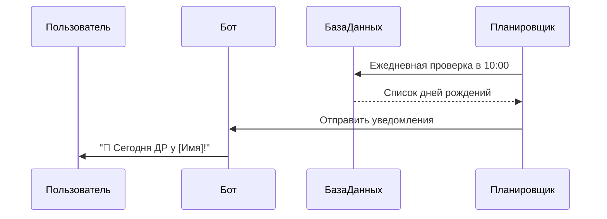
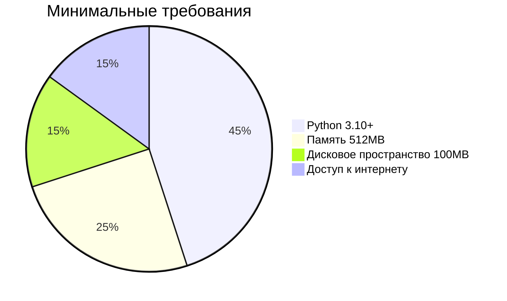
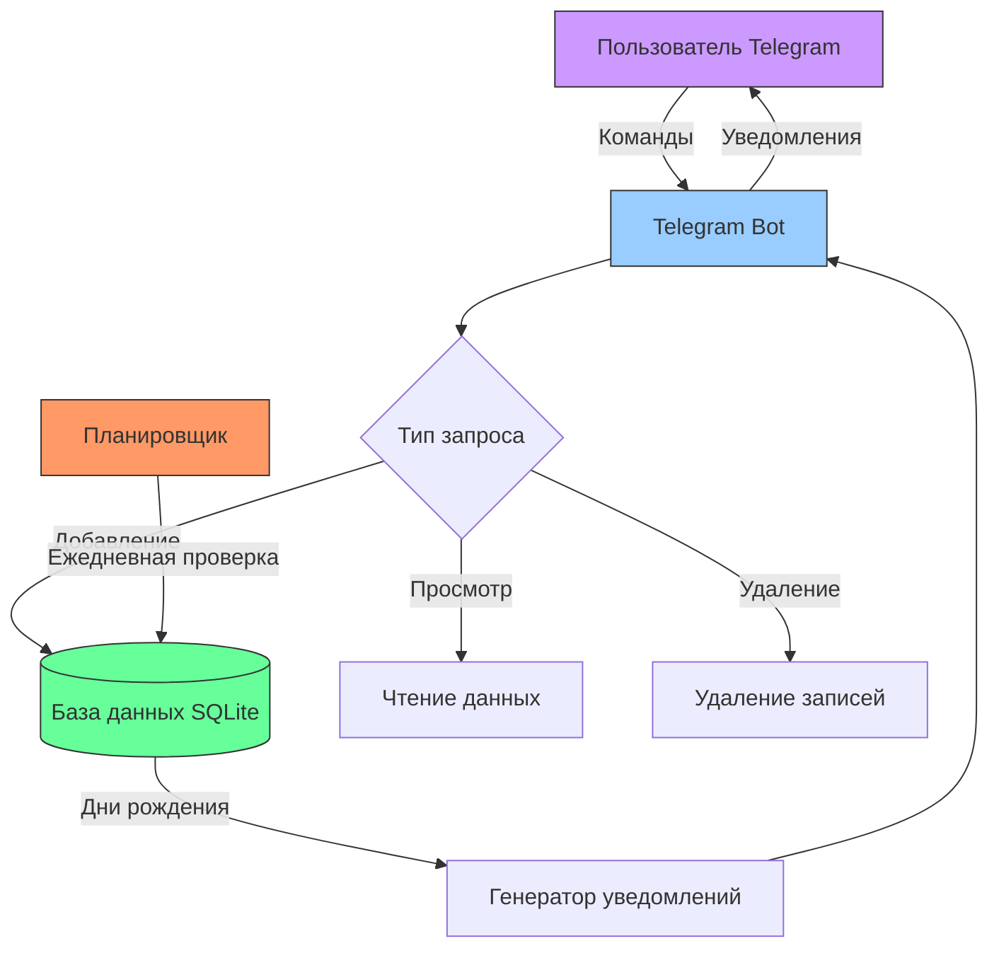

# Отчет по разработке Telegram-бота для напоминаний о днях рождения

## 1. Общая информация

### 1.1 Назначение проекта
**Birthday Reminder Bot** - бот для:
- Управления списком дней рождения
- Автоматических напоминаний
- Персонализированных уведомлений

### 1.2 Основные характеристики
| Параметр       | Значение                     |
|----------------|-----------------------------|
| Язык           | Python 3.10+                |
| База данных    | SQLite                      |
| Пользователи   | Мультипользовательский режим|
| Точность       | Учет времени UTC+3          |

## 2. Технологический стек

### 2.1 Используемые библиотеки
```python  
requirements.txt:
python-telegram-bot==20.7
python-dotenv==1.0.0
sqlite3==3.35+  # Встроенная в Python
```
### 2.2 Структура БД

```
CREATE TABLE IF NOT EXISTS birthdays (
    id INTEGER PRIMARY KEY AUTOINCREMENT,
    name TEXT NOT NULL,
    date DATE NOT NULL,
    user_id INTEGER NOT NULL,
    chat_id INTEGER NOT NULL
);
```
## 3. Функциональные возможности
### 3.1 Команды бота
```

- `/start` - Начало работы
- `/add` - Добавить запись:
  1. Ввод имени
  2. Ввод даты (формат: ДД.ММ.ГГГГ)
- `/list` - Показать все записи
- `/delete` - Удалить запись по имени
```
### 3.2 Логика напоминаний

## 4. Установка и запуск

### 4.1 Требования к системе

### 4.2 Пошаговая инструкция
```
# Клонирование и настройка
git clone https://example.com/bot.git
cd bot
python -m venv venv
source venv/bin/activate  # Linux/Mac
venv\Scripts\activate     # Windows

# Установка зависимостей
pip install -r requirements.txt

# Настройка токена
echo "TELEGRAM_BOT_TOKEN=ваш_токен" > .env

# Запуск
python bot.py
```
## 5. Архитектура системы
### 5.1 Архитектурная схема системы

