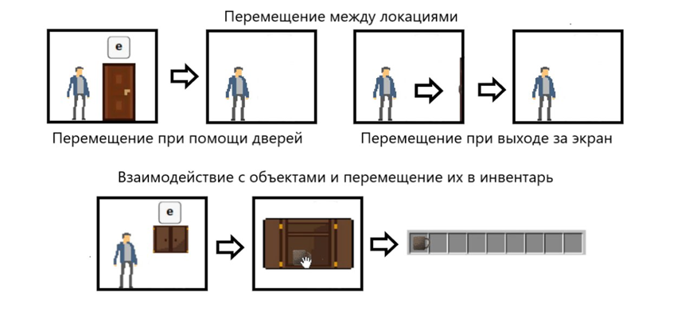

# О проекте

## Цели проекта

Цели проекта «Басманные хроники. Путешествие через вселенные» направлены на создание захватывающего и образовательного игрового опыта, который позволит игрокам глубже понять и изучить историческое и культурное наследие Москвы. Основные цели проекта включают:

**Образование и просвещение:** Создать возможность для игроков узнать о ключевых исторических событиях, культурных особенностях и архитектурных памятниках Москвы, развивая интерес к истории города и его культуре.

**Интерактивность и вовлеченность:** Реализовать нелинейный сюжет, который позволяет игрокам принимать решения, влияющие на развитие игры, чтобы они могли больше погружаться в процесс и чувствовать свою значимость в мире игры.

**Разработка уникального контента:** Создать детализированную игровую среду, которая будет отражать реалии исторического московского контекста, включая развитие персонажей, диалоги и миссии, основанные на реальных событиях.

**Повышение интереса к местной культуре:** Способствовать популяризации культуры и традиций Москвы среди молодежи, привлекая их внимание к значимости сохранения исторического наследия.

**Использование современных технологий:** Применить новейшие технологии и игровые движки для обеспечения высокого качества графики и игрового опыта, что сделает проект привлекательным для широкой аудитории.

**Создание сообщества:** Сформировать активное сообщество игроков, заинтересованных в культурной и исторической жизни Москвы, что способствует обмену знаниями и поддержанию интереса к проекту в долгосрочной перспективе.

## Технологии

### Godot Engine
Игровой движок для создания 2D/3D

### C# и GDScript
Для реализации игровой логики

## Демонстрация

